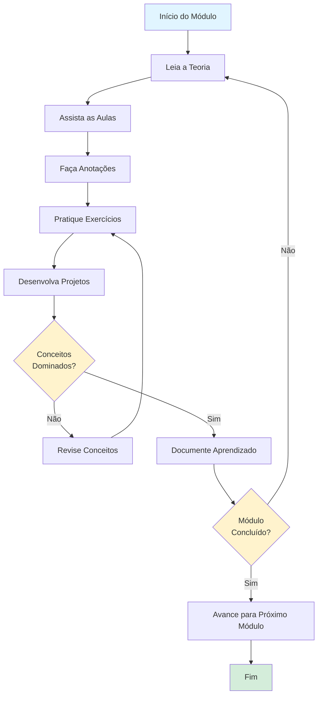
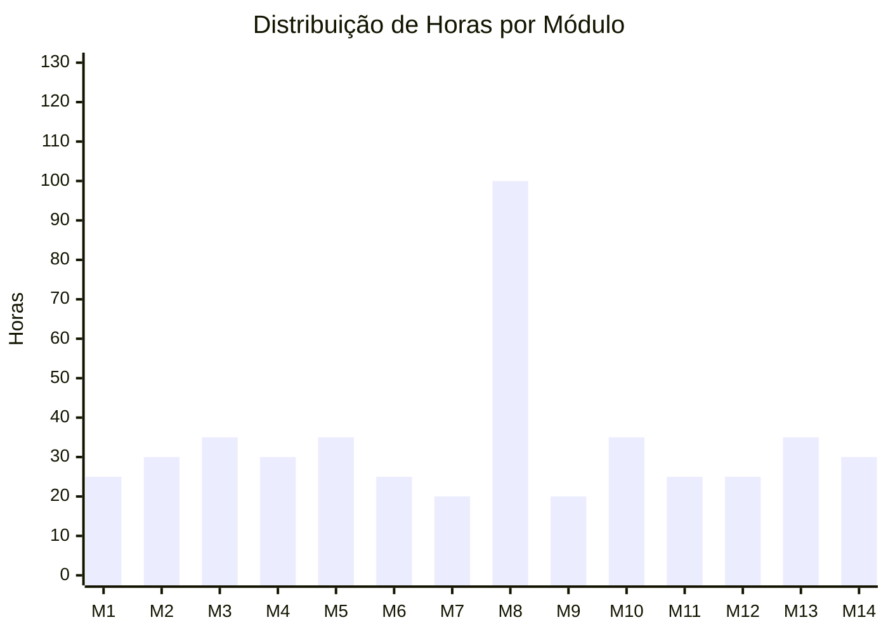
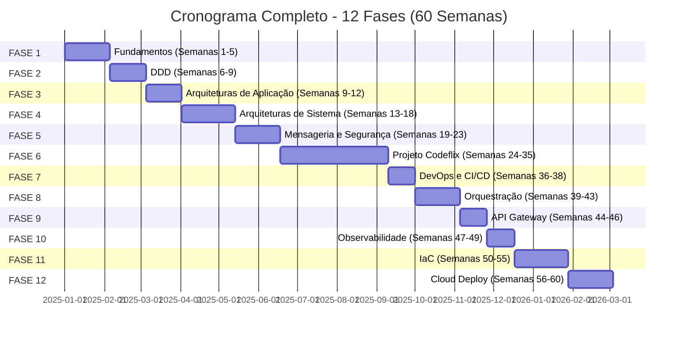
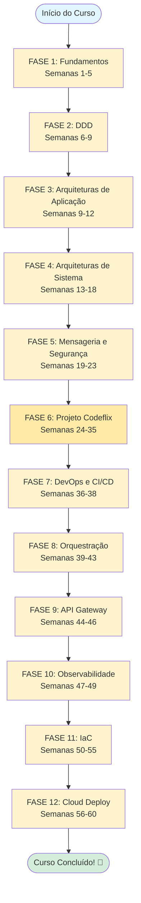
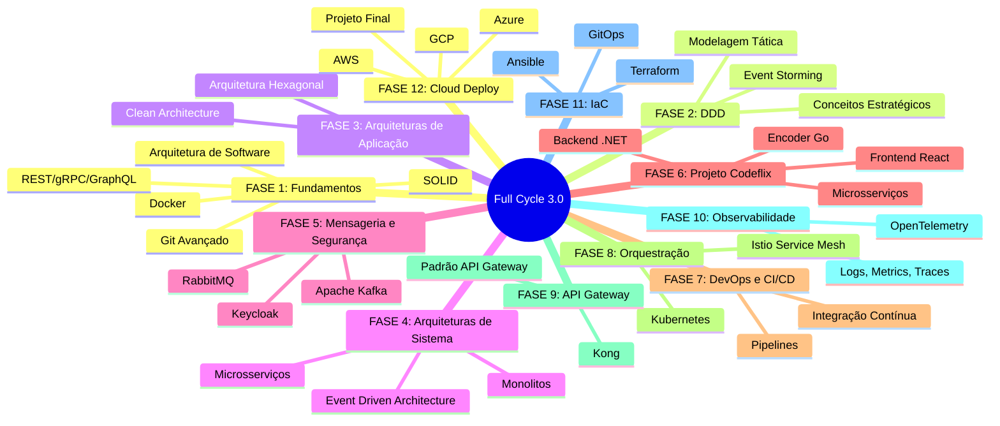

# 📅 Cronograma de Estudos 
- **dop Full Cycle 3.0**

<div align="center">

**Cronograma estruturado para conclusão completa do curso**

[]()
[]()

</div>

---

## 📋 Índice

1. [Como Usar Este Cronograma](#como-usar-este-cronograma)
2. [Estimativas de Tempo](#estimativas-de-tempo)
3. [Cronograma Detalhado](#cronograma-detalhado)
4. [Checklist de Progresso](#checklist-de-progresso)
5. [Dicas de Estudo](#dicas-de-estudo)

---

## Como Usar Este Cronograma

Este cronograma foi criado para guiar seus estudos de forma organizada e eficiente. 

### ⏰ Carga Horária Recomendada

- **Intensivo**: 4-6 horas/dia (conclusão em ~4-5 meses)
- **Moderado**: 2-3 horas/dia (conclusão em ~8-10 meses)
- **Leve**: 1-2 horas/dia (conclusão em ~12-15 meses)

### 📊 Método de Estudo Sugerido

1. **Leia a teoria** antes de assistir as aulas
2. **Assista as aulas** com atenção e faça anotações
3. **Pratique** os exercícios e projetos
4. **Revise** os conceitos antes de avançar
5. **Documente** seu aprendizado

#### 🔄 Fluxograma do Método de Estudo



---

## Estimativas de Tempo

| Módulo | Tempo Estimado (Horas) | Semanas (Moderado) |
|--------|------------------------|-------------------|
| Módulo 1: Fundamentos | 20-30h | 2-3 semanas |
| Módulo 2: Arquitetura de Software | 25-35h | 3-4 semanas |
| Módulo 3: DDD | 30-40h | 3-4 semanas |
| Módulo 4: Arquiteturas de Aplicação | 25-35h | 3-4 semanas |
| Módulo 5: Arquiteturas de Sistema | 30-40h | 3-4 semanas |
| Módulo 6: Mensageria | 20-30h | 2-3 semanas |
| Módulo 7: Segurança | 15-25h | 2-3 semanas |
| Módulo 8: Projeto Codeflix | 80-120h | 8-12 semanas |
| Módulo 9: CI/CD | 15-25h | 2-3 semanas |
| Módulo 10: Orquestração | 30-40h | 3-4 semanas |
| Módulo 11: API Gateway | 20-30h | 2-3 semanas |
| Módulo 12: Observabilidade | 20-30h | 2-3 semanas |
| Módulo 13: IaC | 30-40h | 3-4 semanas |
| Módulo 14: Cloud Deploy | 25-35h | 3-4 semanas |
| **TOTAL** | **~395-545h** | **~40-60 semanas** |

#### 📈 Gráfico de Estimativas de Tempo

```mermaid
gantt
    title Estimativas de Tempo por Módulo (Horas)
    dateFormat X
    axisFormat %s h
    
    section Fundamentos
    Módulo 1: Fundamentos (20-30h) :0, 25
    Módulo 2: Arquitetura de Software (25-35h) :25, 30
    
    section DDD e Arquiteturas
    Módulo 3: DDD (30-40h) :55, 35
    Módulo 4: Arquiteturas de Aplicação (25-35h) :90, 30
    Módulo 5: Arquiteturas de Sistema (30-40h) :120, 35
    
    section Mensageria e Segurança
    Módulo 6: Mensageria (20-30h) :155, 25
    Módulo 7: Segurança (15-25h) :180, 20
    
    section Projeto e DevOps
    Módulo 8: Projeto Codeflix (80-120h) :200, 100
    Módulo 9: CI/CD (15-25h) :300, 20
    
    section Orquestração e Gateway
    Módulo 10: Orquestração (30-40h) :320, 35
    Módulo 11: API Gateway (20-30h) :355, 25
    
    section Observabilidade e IaC
    Módulo 12: Observabilidade (20-30h) :380, 25
    Módulo 13: IaC (30-40h) :405, 35
    Módulo 14: Cloud Deploy (25-35h) :440, 30
```



---

## 📊 Visão Geral das Fases

### 🗺️ Timeline das Fases do Curso



### 🔄 Fluxograma das Fases



### 📋 Resumo das Fases



---

## Cronograma Detalhado

### 🎯 FASE 1: Fundamentos (Semanas 1-5)

#### Semana 1: Introdução e Docker
**Objetivo**: Compreender os fundamentos e configurar ambiente de desenvolvimento

📁 **[Ver detalhes da Semana 1](./semanas/semana-01/README.md)**

- [ ] **Dia 1-2**: Comece por Aqui (Leitura e orientações)
  - Leia todas as informações importantes
  - Configure seu ambiente de estudo
  - Organize seu espaço de trabalho
  
- [ ] **Dia 3-5**: Docker
  - Conceitos de containers
  - Dockerfile e Docker Compose
  - Práticas e exercícios
  - **Meta**: Criar e gerenciar containers básicos

- [ ] **Dia 6-7**: Padrões e Técnicas Avançadas com Git
  - Gitflow workflow
  - Convenções de commits
  - Code reviews
  - **Meta**: Dominar Git e GitHub para trabalho em equipe

**Checkpoint Semana 1**: ✅ Certificados disponíveis para Docker e Git

---

#### Semana 2-3: Fundamentos de Arquitetura
**Objetivo**: Entender os princípios fundamentais de arquitetura de software

📁 **[Ver detalhes da Semana 2](./semanas/semana-02/README.md)** | 📁 **[Ver detalhes da Semana 3](./semanas/semana-03/README.md)**

- [ ] **Semana 2**: Fundamentos da Arquitetura de Software
  - Performance, Escalabilidade, Resiliência
  - Princípios de design
  - Estudos de caso
  
- [ ] **Semana 3**: SOLID Express
  - Cada um dos 5 princípios
  - Aplicação prática
  - Refatoração de código
  - **Meta**: Aplicar SOLID em projetos práticos

**Checkpoint Semana 3**: ✅ Certificados disponíveis

---

#### Semana 4-5: Comunicação entre Sistemas
**Objetivo**: Dominar diferentes protocolos de comunicação

📁 **[Ver detalhes da Semana 4](./semanas/semana-04/README.md)** | 📁 **[Ver detalhes da Semana 5](./semanas/semana-05/README.md)**

- [ ] **Semana 4**: REST API e gRPC
  - REST: conceitos e práticas
  - gRPC: implementação
  - Comparação e casos de uso
  
- [ ] **Semana 5**: GraphQL e Comparação
  - GraphQL: queries e mutations
  - Quando usar cada protocolo
  - Projeto prático integrando todos

**Checkpoint Semana 5**: 🔄 24% concluído

---

### 🎯 FASE 2: Domain Driven Design (Semanas 6-9)

#### Semana 6: DDD - Conceitos Estratégicos
**Objetivo**: Compreender DDD e seus conceitos fundamentais

📁 **[Ver detalhes da Semana 6](./semanas/semana-06/README.md)**

- [ ] **Dia 1-3**: Domain Driven Design
  - Bounded Contexts
  - Ubiquitous Language
  - Domain Models
  - Strategic Design
  
- [ ] **Dia 4-5**: Event Storming na Prática
  - Workshop prático
  - Identificação de eventos
  - Mapeamento de domínios
  
- [ ] **Dia 6-7**: Revisão e prática
  - Exercícios de modelagem
  - Estudos de caso

**Checkpoint Semana 6**: ✅ Certificados disponíveis

---

#### Semana 7-8: DDD - Modelagem Tática
**Objetivo**: Aplicar patterns táticos do DDD

📁 **[Ver detalhes da Semana 7](./semanas/semana-07/README.md)** | 📁 **[Ver detalhes da Semana 8](./semanas/semana-08/README.md)**

- [ ] **Semana 7**: Entities, Value Objects e Aggregates
  - Diferenças e quando usar
  - Implementação prática
  - Regras de negócio
  
- [ ] **Semana 8**: Domain Services, Repositories e Events
  - Domain Services
  - Repository pattern
  - Domain Events
  - Projeto prático completo

**Checkpoint Semana 8**: 🔄 2% concluído (continuar estudos)

---

### 🎯 FASE 3: Arquiteturas de Aplicação (Semanas 9-12)

#### Semana 9: Arquitetura Hexagonal
**Objetivo**: Implementar Ports and Adapters

📁 **[Ver detalhes da Semana 9](./semanas/semana-09/README.md)**

- [ ] **Dia 1-4**: Conceitos e implementação
  - Ports (interfaces)
  - Adapters (implementações)
  - Desacoplamento
  
- [ ] **Dia 5-7**: Projeto prático
  - Refatorar aplicação existente
  - Testes e validação

**Checkpoint Semana 9**: ✅ Certificado disponível

---

#### Semana 10-12: Clean Architecture
**Objetivo**: Dominar Clean Architecture

📁 **[Ver detalhes da Semana 10](./semanas/semana-10/README.md)** | 📁 **[Ver detalhes da Semana 11](./semanas/semana-11/README.md)** | 📁 **[Ver detalhes da Semana 12](./semanas/semana-12/README.md)**

- [ ] **Semana 10**: Fundamentos
  - Camadas da Clean Architecture
  - Dependency Rule
  - Use Cases
  
- [ ] **Semana 11**: Implementação
  - Estrutura de projeto
  - Frameworks independence
  - Testabilidade
  
- [ ] **Semana 12**: Projeto completo
  - Aplicação prática
  - Refatoração
  - Boas práticas

**Checkpoint Semana 12**: 🔄 27% concluído (continuar estudos)

---

### 🎯 FASE 4: Arquiteturas de Sistema (Semanas 13-18)

#### Semana 13: Sistemas Monolíticos
**Objetivo**: Entender quando e como usar monolitos

📁 **[Ver detalhes da Semana 13](./semanas/semana-13/README.md)**

- [ ] **Dia 1-4**: Conceitos
  - Vantagens e desvantagens
  - Modularização
  - Padrões de organização
  
- [ ] **Dia 5-7**: Prática
  - Projeto monolítico modular
  - Boas práticas

**Checkpoint Semana 13**: 🔄 1% concluído

---

#### Semana 14-16: Microsserviços
**Objetivo**: Dominar arquitetura de microsserviços

📁 **[Ver detalhes da Semana 14](./semanas/semana-14/README.md)** | 📁 **[Ver detalhes da Semana 15](./semanas/semana-15/README.md)** | 📁 **[Ver detalhes da Semana 16](./semanas/semana-16/README.md)**

- [ ] **Semana 14**: Fundamentos
  - Princípios de microsserviços
  - Decomposição de serviços
  - Comunicação entre serviços
  
- [ ] **Semana 15**: Padrões e práticas
  - Service discovery
  - API Gateway (introdução)
  - Circuit breaker
  
- [ ] **Semana 16**: Projeto prático
  - Implementação de microsserviços
  - Desafios e soluções

**Checkpoint Semana 16**: 🔄 23% concluído

---

#### Semana 17-18: Event Driven Architecture
**Objetivo**: Implementar comunicação assíncrona

📁 **[Ver detalhes da Semana 17](./semanas/semana-17/README.md)** | 📁 **[Ver detalhes da Semana 18](./semanas/semana-18/README.md)**

- [ ] **Semana 17**: EDA Concepts
  - Event-driven patterns
  - Event sourcing
  - CQRS
  
- [ ] **Semana 18**: Implementação prática
  - Projeto com EDA
  - Integração com microsserviços

**Checkpoint Semana 18**: 🔄 0% concluído (iniciar estudos)

---

### 🎯 FASE 5: Mensageria e Segurança (Semanas 19-23)

#### Semana 19-20: RabbitMQ
**Objetivo**: Dominar RabbitMQ para mensageria

📁 **[Ver detalhes da Semana 19](./semanas/semana-19/README.md)** | 📁 **[Ver detalhes da Semana 20](./semanas/semana-20/README.md)**

- [ ] **Semana 19**: Fundamentos
  - Exchanges e Queues
  - Routing patterns
  - Message durability
  
- [ ] **Semana 20**: Avançado
  - Clustering
  - Performance
  - Projeto prático

**Checkpoint Semana 20**: ✅ Certificado disponível

---

#### Semana 21-22: Apache Kafka
**Objetivo**: Implementar streams de dados com Kafka

📁 **[Ver detalhes da Semana 21](./semanas/semana-21/README.md)** | 📁 **[Ver detalhes da Semana 22](./semanas/semana-22/README.md)**

- [ ] **Semana 21**: Conceitos
  - Topics e Partitions
  - Producers e Consumers
  - Stream processing
  
- [ ] **Semana 22**: Prática
  - High throughput
  - Integração com aplicações
  - Projeto completo

**Checkpoint Semana 22**: 🔄 0% concluído (iniciar estudos)

---

#### Semana 23: Autenticação e Keycloak
**Objetivo**: Implementar autenticação e autorização

📁 **[Ver detalhes da Semana 23](./semanas/semana-23/README.md)**

- [ ] **Dia 1-4**: OAuth 2.0 e OpenID Connect
  - Conceitos fundamentais
  - Fluxos de autenticação
  
- [ ] **Dia 5-7**: Keycloak
  - Configuração
  - SSO
  - Integração com aplicações

**Checkpoint Semana 23**: 🔄 19% concluído

---

### 🎯 FASE 6: Projeto Prático Codeflix (Semanas 24-35)

#### Semana 24: Arquitetura do Projeto Codeflix
**Objetivo**: Entender a arquitetura completa

📁 **[Ver detalhes da Semana 24](./semanas/semana-24/README.md)**

- [ ] **Dia 1-3**: Diagrama C4
  - Visão geral do sistema
  - Decisões técnicas
  
- [ ] **Dia 4-7**: Planejamento
  - Estrutura de módulos
  - Tecnologias a utilizar
  - Cronograma do projeto

**Checkpoint Semana 24**: ✅ Certificado disponível

---

#### Semana 25-27: Backend - Admin Catálogo (.NET)
**Objetivo**: Criar backend administrativo

📁 **[Ver detalhes da Semana 25](./semanas/semana-25/README.md)** | 📁 **[Ver detalhes da Semana 26](./semanas/semana-26/README.md)** | 📁 **[Ver detalhes da Semana 27](./semanas/semana-27/README.md)**

- [ ] **Semana 25**: Setup e estrutura
  - Configuração do projeto
  - Arquitetura inicial
  
- [ ] **Semana 26**: Implementação core
  - CRUD de catálogo
  - Validações e regras
  
- [ ] **Semana 27**: Finalização
  - Testes
  - Documentação
  - Deploy local

**Checkpoint Semana 27**: 🔄 5% concluído

---

#### Semana 28-29: Frontend - Portal do Usuário (React)
**Objetivo**: Interface do usuário

📁 **[Ver detalhes da Semana 28](./semanas/semana-28/README.md)** | 📁 **[Ver detalhes da Semana 29](./semanas/semana-29/README.md)**

- [ ] **Semana 28**: Setup e componentes
  - Estrutura React
  - Componentes base
  
- [ ] **Semana 29**: Funcionalidades
  - Listagem de vídeos
  - Player de vídeo
  - Integração com backend

**Checkpoint Semana 29**: 🔄 0% concluído

---

#### Semana 30-31: Frontend - Admin (React)
**Objetivo**: Painel administrativo

📁 **[Ver detalhes da Semana 30](./semanas/semana-30/README.md)** | 📁 **[Ver detalhes da Semana 31](./semanas/semana-31/README.md)**

- [ ] **Semana 30**: Interface admin
  - Dashboard
  - Formulários
  
- [ ] **Semana 31**: Integração
  - CRUD completo
  - Autenticação
  - Finalização

**Checkpoint Semana 31**: 🔄 8% concluído

---

#### Semana 32-33: Encoder de Vídeo (Go)
**Objetivo**: Processamento de vídeos

📁 **[Ver detalhes da Semana 32](./semanas/semana-32/README.md)** | 📁 **[Ver detalhes da Semana 33](./semanas/semana-33/README.md)**

- [ ] **Semana 32**: Setup Go
  - Estrutura do projeto
  - Processamento básico
  
- [ ] **Semana 33**: Segurança e otimização
  - Segurança de vídeos
  - Performance
  - Integração

**Checkpoint Semana 33**: 🔄 5% concluído

---

#### Semana 34-35: Microsserviços - API Catálogo
**Objetivo**: Implementar microsserviço de catálogo

📁 **[Ver detalhes da Semana 34](./semanas/semana-34/README.md)** | 📁 **[Ver detalhes da Semana 35](./semanas/semana-35/README.md)**

- [ ] **Semana 34**: Escolha da tecnologia
  - .NET, Java, PHP, Python ou TypeScript
  - Implementação base
  
- [ ] **Semana 35**: Finalização
  - Comunicação entre serviços
  - Testes
  - Documentação

**Checkpoint Semana 35**: Varia conforme tecnologia escolhida

---

### 🎯 FASE 7: DevOps e CI/CD (Semanas 36-38)

#### Semana 36: Integração Contínua
**Objetivo**: Implementar pipelines de CI

📁 **[Ver detalhes da Semana 36](./semanas/semana-36/README.md)**

- [ ] **Dia 1-4**: Conceitos
  - Pipelines de CI
  - Automação de testes
  - Build automatizado
  
- [ ] **Dia 5-7**: Prática
  - Configuração de CI
  - Integração com GitHub Actions
  - Qualidade de código

**Checkpoint Semana 36**: ✅ Certificado disponível

---

#### Semana 37-38: CI/CD - Continuação e Finalização
**Objetivo**: Implementar pipelines de CI/CD completos

📁 **[Ver detalhes da Semana 37](./semanas/semana-37/README.md)** | 📁 **[Ver detalhes da Semana 38](./semanas/semana-38/README.md)**

- [ ] **Semana 37**: Continuação
  - Aprofundamento em CI/CD
  - Práticas avançadas
  
- [ ] **Semana 38**: Finalização
  - Projeto completo
  - Deploy automatizado

**Checkpoint Semana 38**: _Em andamento..._

---

### 🎯 FASE 8: Orquestração (Semanas 39-43)

#### Semana 39-41: Kubernetes
**Objetivo**: Orquestrar containers com Kubernetes

📁 **[Ver detalhes da Semana 39](./semanas/semana-39/README.md)** | 📁 **[Ver detalhes da Semana 40](./semanas/semana-40/README.md)** | 📁 **[Ver detalhes da Semana 41](./semanas/semana-41/README.md)**

- [ ] **Semana 39**: Fundamentos
  - Pods, Services, Deployments
  - ConfigMaps e Secrets
  
- [ ] **Semana 40**: Avançado
  - Ingress
  - Auto-scaling
  - Health checks
  
- [ ] **Semana 41**: Prática
  - Deploy de aplicações
  - Gerenciamento de cluster
  - Troubleshooting

**Checkpoint Semana 41**: 🔄 24% concluído

---

#### Semana 42-43: Service Mesh com Istio
**Objetivo**: Implementar service mesh

📁 **[Ver detalhes da Semana 42](./semanas/semana-42/README.md)** | 📁 **[Ver detalhes da Semana 43](./semanas/semana-43/README.md)**

- [ ] **Semana 42**: Conceitos
  - Service mesh architecture
  - Traffic management
  - Security policies
  
- [ ] **Semana 43**: Prática
  - Observability
  - Implementação completa
  - Integração com Kubernetes

**Checkpoint Semana 43**: 🔄 0% concluído

---

### 🎯 FASE 9: API Gateway (Semanas 44-46)

#### Semana 44: API Gateway
**Objetivo**: Entender padrão API Gateway

📁 **[Ver detalhes da Semana 44](./semanas/semana-44/README.md)**

- [ ] **Dia 1-4**: Conceitos
  - Padrão API Gateway
  - Routing e load balancing
  - Rate limiting
  
- [ ] **Dia 5-7**: Prática
  - Implementação básica
  - Autenticação centralizada

**Checkpoint Semana 44**: 🔄 4% concluído

---

#### Semana 45-46: Kong e Kubernetes
**Objetivo**: Implementar Kong Gateway

📁 **[Ver detalhes da Semana 45](./semanas/semana-45/README.md)** | 📁 **[Ver detalhes da Semana 46](./semanas/semana-46/README.md)**

- [ ] **Semana 45**: Kong Gateway
  - Instalação e configuração
  - Plugins do Kong
  
- [ ] **Semana 46**: Integração
  - Kong com Kubernetes
  - Configuração avançada
  - Projeto completo

**Checkpoint Semana 46**: 🔄 29% concluído

---

### 🎯 FASE 10: Observabilidade (Semanas 47-49)

#### Semana 47: Observabilidade
**Objetivo**: Implementar observabilidade

📁 **[Ver detalhes da Semana 47](./semanas/semana-47/README.md)**

- [ ] **Dia 1-4**: Conceitos
  - Logs, Metrics, Traces
  - Distributed tracing
  - Monitoring strategies
  
- [ ] **Dia 5-7**: Prática
  - Implementação básica
  - Alerting

**Checkpoint Semana 47**: 🔄 11% concluído

---

#### Semana 48-49: OpenTelemetry
**Objetivo**: Padronizar observabilidade

📁 **[Ver detalhes da Semana 48](./semanas/semana-48/README.md)** | 📁 **[Ver detalhes da Semana 49](./semanas/semana-49/README.md)**

- [ ] **Semana 48**: OpenTelemetry
  - Standard e conceitos
  - Instrumentação
  
- [ ] **Semana 49**: Integração
  - Exporters
  - Integração com ferramentas
  - Projeto completo

**Checkpoint Semana 49**: ✅ Certificado disponível

---

### 🎯 FASE 11: Infrastructure as Code (Semanas 50-55)

#### Semana 50-52: Terraform
**Objetivo**: Infraestrutura como código

📁 **[Ver detalhes da Semana 50](./semanas/semana-50/README.md)** | 📁 **[Ver detalhes da Semana 51](./semanas/semana-51/README.md)** | 📁 **[Ver detalhes da Semana 52](./semanas/semana-52/README.md)**

- [ ] **Semana 50**: Fundamentos
  - Infrastructure as Code
  - Providers
  - State management
  
- [ ] **Semana 51**: Avançado
  - Modules
  - Multi-cloud
  - Best practices
  
- [ ] **Semana 52**: Prática
  - Projeto completo
  - Deploy de infraestrutura

**Checkpoint Semana 52**: 🔄 19% concluído

---

#### Semana 53-54: Ansible
**Objetivo**: Automação de configuração

📁 **[Ver detalhes da Semana 53](./semanas/semana-53/README.md)** | 📁 **[Ver detalhes da Semana 54](./semanas/semana-54/README.md)**

- [ ] **Semana 53**: Conceitos
  - Configuration management
  - Playbooks
  - Roles
  
- [ ] **Semana 54**: Prática
  - Agentless architecture
  - Automação completa
  - Integração com Terraform

**Checkpoint Semana 54**: ✅ Certificado disponível

---

#### Semana 55: GitOps
**Objetivo**: Deploy declarativo

📁 **[Ver detalhes da Semana 55](./semanas/semana-55/README.md)**

- [ ] **Dia 1-4**: Conceitos
  - GitOps principles
  - ArgoCD / Flux
  
- [ ] **Dia 5-7**: Prática
  - Declarative deployments
  - Version control for infrastructure
  - Implementação completa

**Checkpoint Semana 55**: ✅ Certificado disponível

---

### 🎯 FASE 12: Deploy em Cloud (Semanas 56-60)

#### Semana 56-60: Deploy nas Cloud Providers
**Objetivo**: Deploy em produção

📁 **[Ver detalhes da Semana 56](./semanas/semana-56/README.md)** | 📁 **[Ver detalhes da Semana 57](./semanas/semana-57/README.md)** | 📁 **[Ver detalhes da Semana 58](./semanas/semana-58/README.md)** | 📁 **[Ver detalhes da Semana 59](./semanas/semana-59/README.md)** | 📁 **[Ver detalhes da Semana 60](./semanas/semana-60/README.md)**

- [ ] **Semana 56**: AWS
  - Container services
  - Serverless
  - Best practices
  
- [ ] **Semana 57**: Azure
  - Azure Kubernetes Service
  - Azure Functions
  - Integração
  
- [ ] **Semana 58**: GCP
  - Google Kubernetes Engine
  - Cloud Functions
  - Multi-cloud
  
- [ ] **Semana 59-60**: Projeto Final Codeflix
  - Deploy completo
  - Monitoramento
  - Otimização
  - Documentação final

**Checkpoint Semana 60**: 🔄 32% concluído | 🎉 **PROJETO FINALIZADO!**

---

## Checklist de Progresso

### 📊 Progresso Geral

- [ ] **Fase 1**: Fundamentos (Semanas 1-5) - 0%
- [ ] **Fase 2**: DDD (Semanas 6-9) - 0%
- [ ] **Fase 3**: Arquiteturas de Aplicação (Semanas 9-12) - 0%
- [ ] **Fase 4**: Arquiteturas de Sistema (Semanas 13-18) - 0%
- [ ] **Fase 5**: Mensageria e Segurança (Semanas 19-23) - 0%
- [ ] **Fase 6**: Projeto Codeflix (Semanas 24-35) - 0%
- [ ] **Fase 7**: DevOps e CI/CD (Semanas 36-38) - 0%
- [ ] **Fase 8**: Orquestração (Semanas 39-43) - 0%
- [ ] **Fase 9**: API Gateway (Semanas 44-46) - 0%
- [ ] **Fase 10**: Observabilidade (Semanas 47-49) - 0%
- [ ] **Fase 11**: IaC (Semanas 50-55) - 0%
- [ ] **Fase 12**: Cloud Deploy (Semanas 56-60) - 0%

### 🏆 Certificados Obtidos

- [ ] Docker
- [ ] Padrões e Técnicas Avançadas com Git e Github
- [ ] Fundamentos da Arquitetura de Software
- [ ] SOLID Express
- [ ] Domain Driven Design
- [ ] Event Storming na Prática
- [ ] Arquitetura Hexagonal
- [ ] RabbitMQ
- [ ] Arquitetura do Projeto Prático - Codeflix
- [ ] Integração Contínua
- [ ] Introdução a OpenTelemetry
- [ ] Ansible
- [ ] GitOps

---

## Dicas de Estudo

### ✅ Boas Práticas

1. **Estabeleça uma rotina**
   - Defina horários fixos para estudo
   - Crie um ambiente adequado
   - Elimine distrações

2. **Pratique constantemente**
   - Não apenas assista, pratique!
   - Crie projetos pessoais
   - Contribua com código

3. **Documente seu aprendizado**
   - Mantenha um caderno de anotações
   - Crie resumos dos conceitos
   - Compartilhe conhecimento

4. **Participe da comunidade**
   - Faça perguntas
   - Ajude outros estudantes
   - Participe de discussões

5. **Revise regularmente**
   - Revise conceitos anteriores
   - Faça exercícios de fixação
   - Aplique em projetos

### ⚠️ Armadilhas a Evitar

- ❌ Pular etapas fundamentais
- ❌ Não praticar o suficiente
- ❌ Estudar sem objetivo claro
- ❌ Não revisar conceitos anteriores
- ❌ Isolar-se da comunidade

### 🎯 Metas Intermediárias

- **Semana 5**: Completar fundamentos
- **Semana 12**: Dominar arquiteturas de aplicação
- **Semana 18**: Entender arquiteturas de sistema
- **Semana 35**: Projeto Codeflix backend completo
- **Semana 49**: Observabilidade implementada
- **Semana 60**: Projeto completo em produção

---

## 📈 Acompanhamento de Progresso

### Como Atualizar Este Cronograma

1. Marque as tarefas concluídas com `[x]`
2. Atualize os percentuais de progresso
3. Adicione notas sobre dificuldades encontradas
4. Documente insights e aprendizados

### Exemplo de Registro Semanal

```markdown
## Semana 1 - Registro

**Data**: 01/01/2025 - 07/01/2025

**Concluído**:
- [x] Docker - Conceitos básicos
- [x] Docker - Dockerfile
- [ ] Docker - Docker Compose (em andamento)

**Dificuldades**:
- Compreender networking entre containers

**Próximos Passos**:
- Finalizar Docker Compose
- Iniciar Git avançado
```

---

## 🎓 Recursos Adicionais

### 📚 Materiais de Apoio

- Documentação oficial das tecnologias
- Livros recomendados por módulo
- Artigos e tutoriais complementares
- Projetos open source para estudo

### 💬 Comunidade

- Discord/Slack do curso
- Fóruns de discussão
- Grupos de estudo
- Code reviews entre alunos

---

<div align="center">

**Bons estudos! 🚀**

*Lembre-se: O aprendizado é uma jornada, não uma corrida. Dedique-se e pratique constantemente.*

**Última atualização**: Janeiro 2025

</div>
